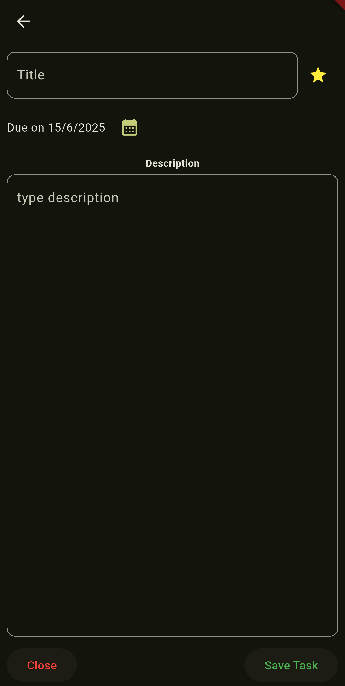
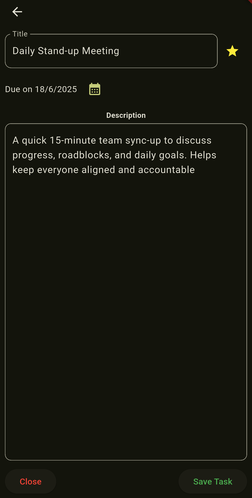
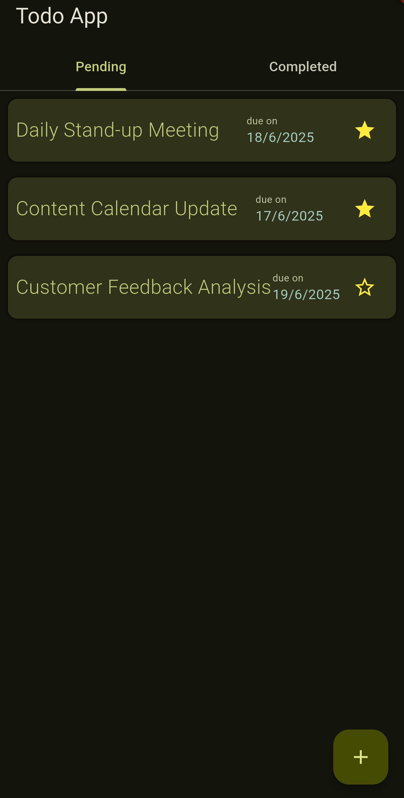
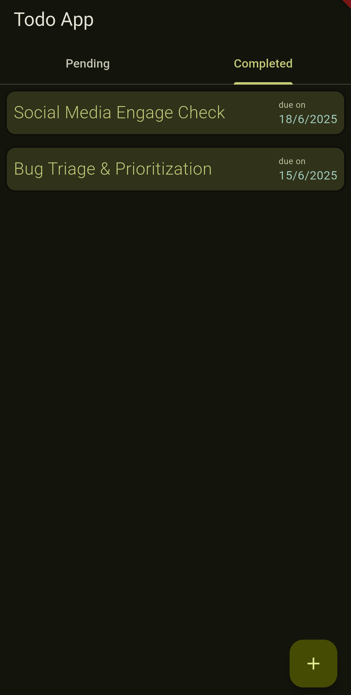

# ✅ Todo App

A simple and intuitive Flutter Todo application that helps you manage your tasks efficiently. Add tasks, mark them as important, edit or delete them, and track your progress with ease. All task data is stored locally using the `sqflite` package.

## ✨ Features

- ➕ Add a new task
- ✏️ Edit an existing task
- ⭐ Mark a task as **important**
- ✅ Swipe **left** on a task in **Pending Tasks** to mark it as **Completed**
- 🗑️ Swipe **right** on a task in **Pending Tasks** to **delete**
- 🔁 Swipe **either direction** on a task in **Completed Tasks** to **remove** it
- 🧠 Persistent local storage using `sqflite` (SQLite)

## 📱 Screenshots

<div align="center">

<table>
  <tr>
    <td align="center">
      <br/>
      <i>Screen to add a new task</i>
    </td>
    <td align="center">
      <br/>
      <i>Edit an existing task</i>
    </td>
  </tr>
  <tr>
    <td align="center">
      <br/>
      <i>Swipe left to complete, right to delete</i>
    </td>
    <td align="center">
      <br/>
      <i>Swipe in any direction to remove completed tasks</i>
    </td>
  </tr>
</table>

</div>

## 🛠️ Tech Stack

- **Flutter** (UI framework)
- **Dart**
- **sqflite** (local SQLite storage)
- **path_provider** (for locating database path)

## 🗃️ Local Database

- Tasks are stored persistently using `sqflite`.
- Schema includes fields for: `id`, `title`, `description`, `isImportant`, `isCompleted`, `timestamp`.

## 🚀 Getting Started

### Prerequisites

- Flutter SDK ([Installation Guide](https://flutter.dev/docs/get-started/install))
- A device/emulator to run the app

### Installation

1. **Clone the repository**
   ```bash
   git clone https://github.com/barathan76/todo_app.git
   cd todo_app
